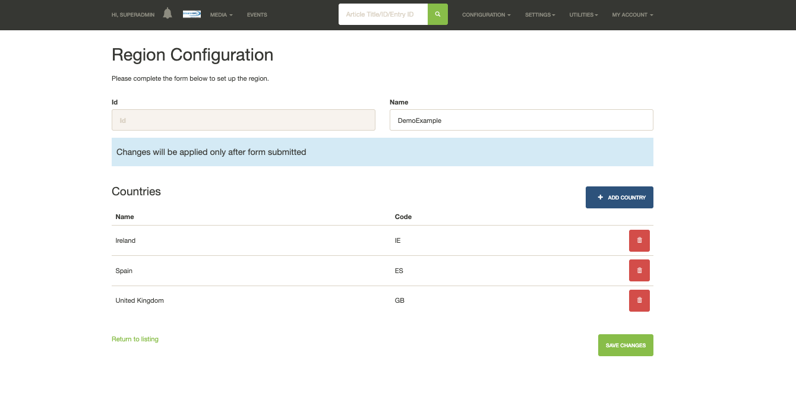
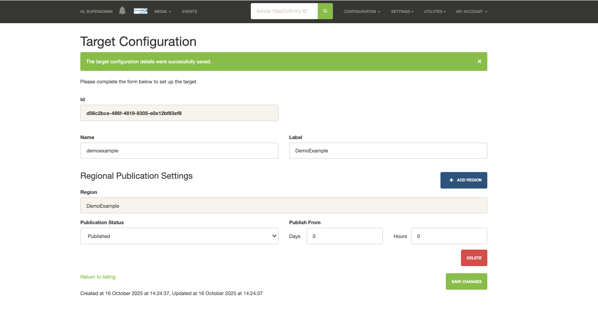
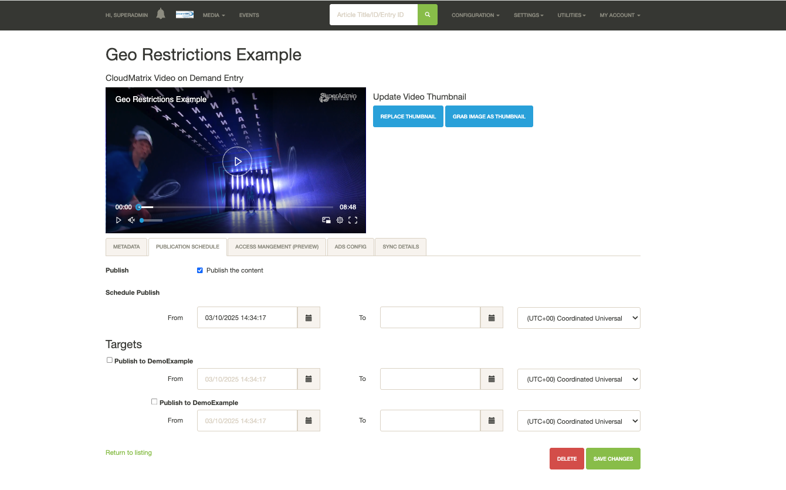
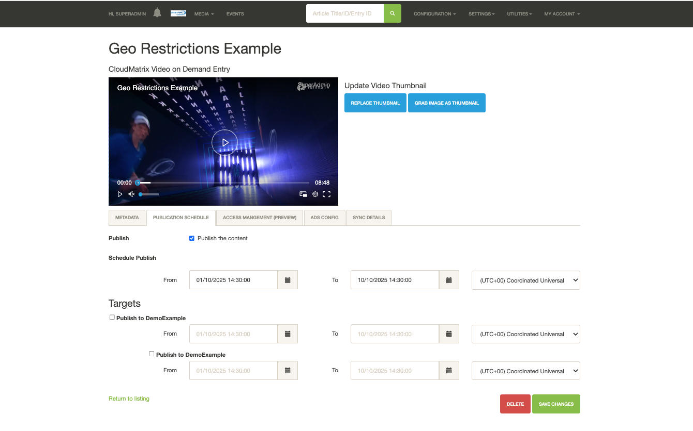
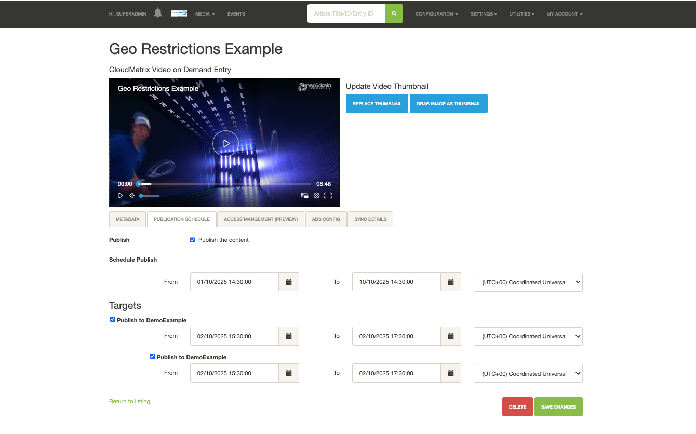
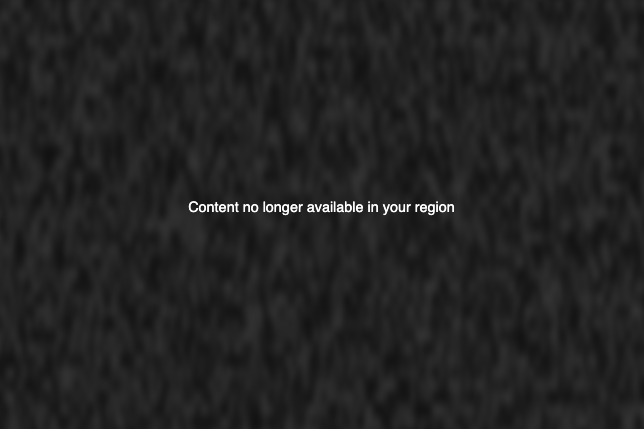
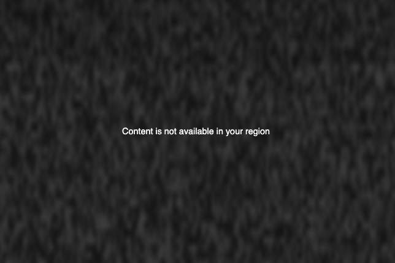
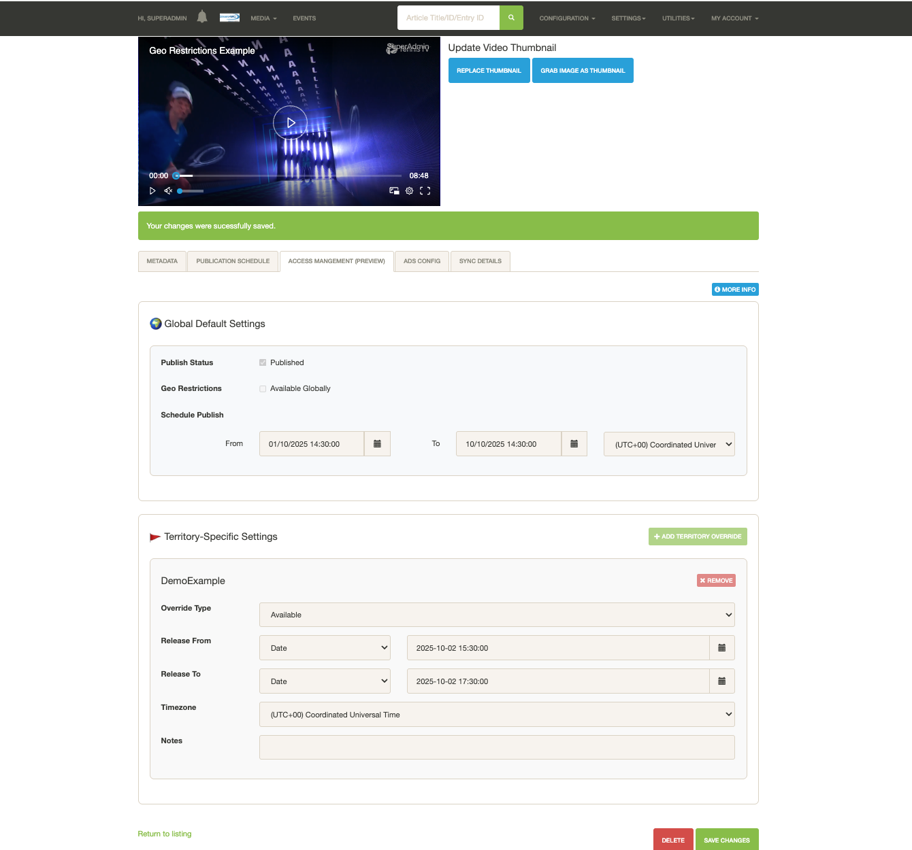

# Geo Restrictions — Integration with Playback SNS Datastore and CloudMatrix

The information provided below is intended to help guide the setup and use of the new **GEO Restrictions** solution.  

### CloudMatrix Geo Restriction Setup

#### 1. Create a Region

1. Sign in to your CloudMatrix platform.  
2. In the top right corner, click `Configuration > Regions`.  
3. Click `Create New`.  
4. Provide your region with a name.  
5. Click the `Add Country` button.  
6. Select the countries you wish to apply Geo Restrictions to, then save.  

**Example:**

#### 2. Create a Target and assign a Region

1. In the top right corner, click Configuration > Targets.
2. Click Create New.
3. Provide your target with a name and label.
4. Click the Add Region button.
5. Select The Region and click Add
6. Set when the region is to be published and save

**Example:**

#### 3. Set Geo restriction on Article

With the above now setup, you can apply this targetted geo restriction to an article on the article page

## Geo Restriction & Playback Logic

Below are a few examples where Geo Restriction have been set and an explenaton on how Playback SDK will:

### No Target / Region Set (Globally avaliable)
Here is an example of where an article will be globally available for all between the given **To** and **From**

Once this time has passed the article will not be published and Playback will not play the media

### Target / Region Set

Here is an example where a Geo Restriction has been set for a given target that holds a set of regions. This means that the content will only be available in these regions for the specified dates and times, **regardless** of the “Publish To” time.

For example, in the image below you can see that the Scheduled Published Item is set from **01/10/2026 14:30:00** to **10/10/2026 14:30:00**, but the Target and Region are set from **02/10/2026 15:30:00** to **02/10/2026 17:30:00**.  

Playback will do the following:

- Only play the media requested in the specified countries.  
- Only play the media requested during the “from” and “to” times set in the Region / Target.

## Playback SDK Overlays

Below is an example of what the Playback SDK will return

-  if the media has a Geo Restriction applied and is within the specified “from” and “to” time.

- if the media has a Geo Restriction applied and the country you are accessing it from is not allowed to access the media

## CloudMatrix Access Management (Preview)

As part of the new Geo Restrictions work, a preview tab for Geo Restrictions has been added called `Access Management (Preview)`. The purpose of this is to allow you, as the user of CloudMatrix, to have an overview of what restrictions are applied.

### Example

Article set with Target and Region:  

Preview page:  

