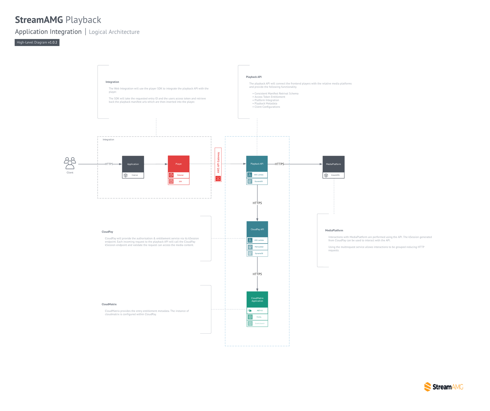

# Playback API

The Playback API provides the functionality for media streams to be consumed by any external video player and removes the dependency on an integrated OVP platform such as Kaltura.

### High-Level Architecture

The following diagram provides a high-level overview:

