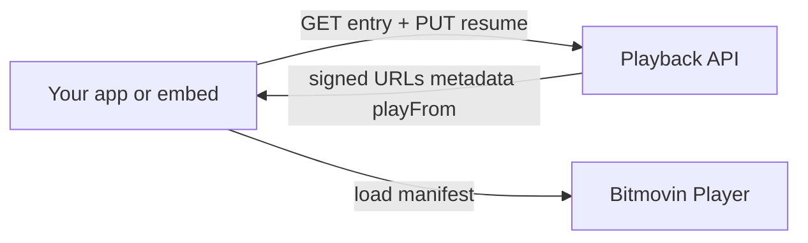

# Player Integrations

Playback integrates with **[Bitmovin Player](https://bitmovin.com/video-player)** for web playback. This page describes **optional features** that attach to Playback and Bitmovin — how they work, which auth models they support, and where to read more.

Unless noted, features are **turned on in your Playback configuration** by StreamAMG during onboarding (not via self-service edits in this portal).

---

## Integration overview

| Integration | Playback role | Bitmovin role |
|-------------|---------------|---------------|
| **API + custom player** | Auth, entitlements, manifests, resume store | Play, seek, timeShift, UI, analytics module |
| **Embed player** | Same API calls internally | Pre-wired Bitmovin instance |
| **SDK** | Wrapper around API + Bitmovin | Same as custom (legacy path) |

Start with [Getting Started](./Getting-Started.md) if you have not chosen a path yet.

---

## Authentication and entitlements

Playback decides whether a viewer may watch an entry **before** returning manifests.

| Access level | Headers on `GET /v1/entry/{id}` |
|--------------|----------------------------------|
| Free-to-watch | `x-api-key` only |
| Freemium / premium | `x-api-key` + `Authorization: Bearer` |

Your site’s **auth model** (configured by StreamAMG) determines how tokens are validated:

| Model | Typical use | Notes |
|-------|-------------|--------|
| **Fusion** | StreamAMG / platform SSO | Supports HTTP **resume PUT** |
| **CloudPay** | Subscription / CloudPay stack | Legacy resume (not HTTP PUT in this portal) |
| **JWKS** | Customer-hosted signing keys | Supports HTTP **resume PUT** |
| **JWT enrichment** | Claims in your SSO token | See [JWT enrichment](./External-Entitlements-JWT-Enrichment.md) |

Embed authentication pattern: store token in `localStorage` — [Embed Player — authentication](./embed-player/Embed-Player.md).

API details: [Playback API](../reference/Playback-API.yaml).

---

## Resume playback

Lets signed-in viewers continue from their last position on the same entry (VoD and live).

| Auth | Read (`playFrom` on GET) | Write (`PUT …/resume`) |
|------|--------------------------|-------------------------|
| **Fusion** | Yes, when enabled | Yes — [Resume hub](./resume/Resume-Playback-External-Bitmovin.md) |
| **JWKS** | Yes, when enabled | Yes |
| **CloudPay** | Yes (legacy store) | **No** — use CloudPay / SDK resume channel |

**Custom Bitmovin integrators**

- [VoD step-by-step + full example](./resume/Resume-Playback-External-Bitmovin-VoD.md)
- [Live / DVR step-by-step + full example](./resume/Resume-Playback-External-Bitmovin-Live.md)
- [Playback Resume API](../reference/Playback-Resume-API.yaml)

**Embed / SDK:** resume is handled when enabled on your configuration and a viewer token is present.

---

## Global adverts

Server-side **pre / mid / post** advert schedules can be returned on the playback response and played through Bitmovin.

- Configured in **Playback Configuration** as `globalAdverts` (StreamAMG / CloudMatrix onboarding).
- Positions: **`Pre`**, **`Mid`**, **`Post`** — for VoD and live.
- Scope can be global or limited per entry in CloudMatrix.

Configuration API: [Playback Configuration API](../reference/Playback-Configuration-API.yaml) (`globalAdverts` schema).  
Example payloads: internal [Client Playback Examples](./Config-Examples.md).

---

## Analytics

| Provider | Status | Integration |
|----------|--------|-------------|
| **Bitmovin Analytics** | Current default for new configs | License key on embed (`data-bitmovin-analytics-key`) or player module in custom/SDK setups |
| **MUX** | Legacy on some tenants | Being phased out where Bitmovin Analytics is adopted |

Embed: [Bitmovin Analytics key](./embed-player/Embed-Player.md#bitmovin-analytics-key-optional).  
Internal migration notes: [Analytics Migration](./Analytics-Migration.md) (StreamAMG staff).

---

## Geo restrictions

Restrict playback by country/region using CloudMatrix **Regions** and **Targets**, applied to articles/entries. Playback enforces rules on `GET` (e.g. **403** when blocked).

Setup and behaviour: [Geo Restrictions](./Geo-Restrictions-External.md).

---

## Bitmovin player UI

Playback does not replace Bitmovin’s UI — you style it with CSS and Bitmovin’s UI configuration.

- [Video Player Configuration](./Video-Players.md) — CSS class reference and examples  
- [Bitmovin UI styling demo](https://bitmovin.com/demos/player-ui-styling)

---

## SDK-only layouts (maintenance)

These features are documented under **SDK** for teams still on `playback.js`:

| Feature | Guide |
|---------|--------|
| Multiview | [SDK Multiview](./SDK/Multiview.md) |
| Playlist | [SDK Playlist](./SDK/Playlist.md) |
| Errors | [SDK Error Handling](./SDK/Error-Handling.md) |

New experiences should prefer **API + Bitmovin** unless you are extending an existing SDK integration.

---

## Feature checklist (for integrators)

Use with StreamAMG during kickoff:

- [ ] Auth model: Fusion / CloudPay / JWKS / external JWT  
- [ ] Entry id format in URLs (Kaltura id vs UUID)  
- [ ] Resume required? (if yes: Fusion or JWKS for HTTP PUT)  
- [ ] Global adverts? Positions and entry scope  
- [ ] Bitmovin Analytics key?  
- [ ] Geo restrictions?  
- [ ] Integration path: API + Bitmovin / embed / SDK  

---

## Related documentation

- [Introduction](./Introduction.md) — platform overview  
- [Getting Started](./Getting-Started.md) — first API call and path selection  
- [Embed Player](./embed-player/Embed-Player.md)  
- [Resume hub](./resume/Resume-Playback-External-Bitmovin.md)  
- API references in the sidebar (**Playback API**, **Playback Resume API**, **Playback Configuration API**)
