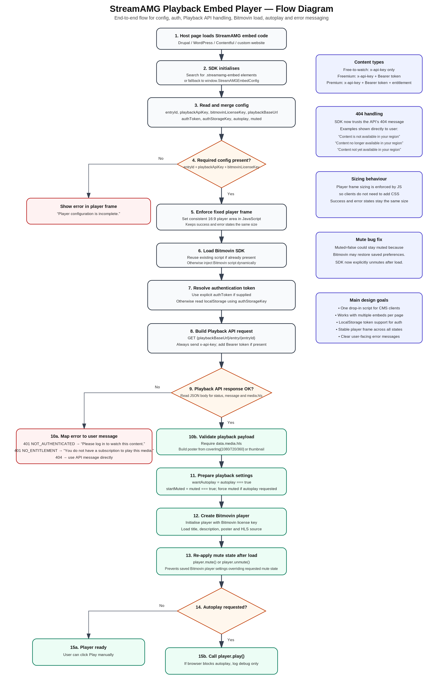

# StreamAMG Playback Embed — Flow Overview

This document provides a high-level overview of how the StreamAMG Playback Embed Player works, from initial page load through to video playback or error handling.

---

## Flow Diagram

---

## Overview

The StreamAMG Playback Embed Player is a lightweight, drop-in JavaScript solution that allows clients to embed video playback into any CMS or website (e.g. Drupal, WordPress, Contentful).

The player:

- Dynamically loads the Bitmovin Player SDK
- Calls the StreamAMG Playback API
- Handles authentication (if required)
- Displays the video or a user-friendly error message

---

## Key Steps

### 1. Embed Initialisation
- The client adds a simple HTML embed snippet to their page
- The SDK locates all `.streamamg-embed` elements or uses a global config

---

### 2. Configuration Handling
The SDK reads configuration from:
- HTML `data-*` attributes **or**
- `window.StreamAMGEmbedConfig`

Required fields:
- `entryId`
- `playbackApiKey`
- `bitmovinLicenseKey`

---

### 3. Player Frame Setup
- The SDK enforces a fixed 16:9 aspect ratio
- Ensures consistent sizing across playback and error states
- No client CSS required

---

### 4. Authentication Handling

The SDK resolves a token in the following order:

1. `data-auth-token` (if provided)
2. `localStorage` using `streamamg_auth_token`

---

### 5. Playback API Request

GET /v1/entry/{entryId}

Headers:
- `x-api-key` (always required)
- `Authorization: Bearer {token}` (if available)

---

### 6. Response Handling

#### Success
- Extract HLS stream URL (`data.media.hls`)
- Build poster image from available sources
- Initialise Bitmovin player

#### Error Handling
Errors are mapped to user-friendly messages:

| Status | Behaviour |
|--------|----------|
| 401 | Login required |
| 401 (NO_ENTITLEMENT) | Subscription required |
| 403 | Access denied |
| 404 | Uses API message directly |

Example 404 messages:
- "Content is not available in your region"
- "Content no longer available in your region"
- "Content not yet available in your region"

---

### 7. Player Initialisation

- Bitmovin player is dynamically loaded
- Player is initialised with:
  - Title
  - Description
  - Poster
  - HLS stream

---

### 8. Mute & Autoplay Logic

- If `autoplay = true`, video is forced to start muted (browser requirement)
- After loading, the SDK explicitly sets mute state to avoid conflicts with saved player preferences

---

### 9. Playback Behaviour

| Scenario | Outcome |
|----------|--------|
| Autoplay enabled | Attempts `player.play()` |
| Autoplay blocked | Logs debug only |
| Autoplay disabled | Waits for user interaction |

---

## Design Principles

The SDK is designed to be:

- Plug-and-play (no client CSS required)
- CMS agnostic
- Consistent UI
- Secure
- User-friendly

---

## Summary

The StreamAMG Playback Embed Player:

1. Loads on any webpage
2. Resolves configuration and authentication
3. Calls the Playback API
4. Either plays video or displays an error

All within a consistent player frame.
